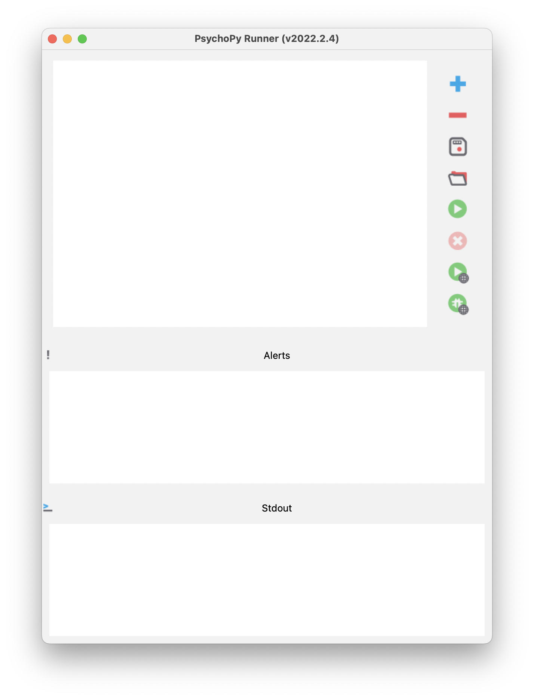

# fMRI Experiment Programming Project
## Notes

Folder named **Resources** and **Data** will be ignored by the git program. This way some unecessary resources will be run locally to limit the space took up in git repository. 

## To-do list

- [ ] some thing needs to be added
- [ ] 

## How to setup the environment

Download the latest version of the Psychopy from their github release page. https://github.com/psychopy/psychopy/releases. The version we use in this study is PsychoPy 2022.2.4. 

The program is a standalone app which don't need any other packages. It contains some necessary libaries which come in handy. The main program opens with three windows. The one we need is the **Runner** window. 

## Resources

Psychopy reference manual: https://psychopy.org/api/index.html

Github source code: https://github.com/psychopy/psychopy

Books: **Building Experiments in PsychoPy** (for Builder usage, gives an idea of how psychopy works)

Books: https://www.psychopy.org/PsychoPyManual.pdf (detailed references)

